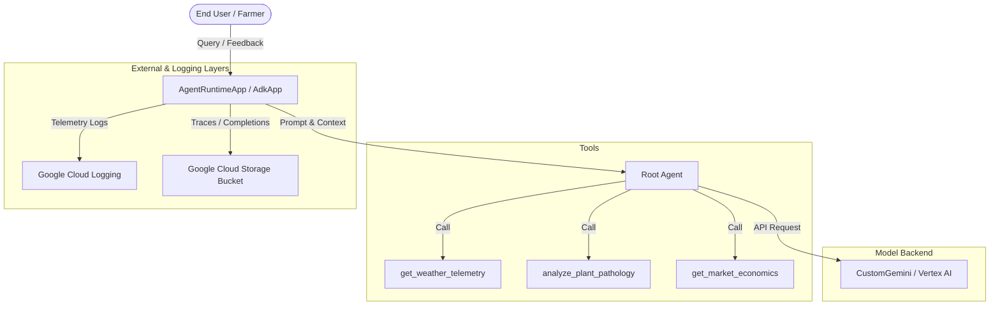

# STRIDE Threat Model Assessment: AgriShield

This document details the threat modeling assessment performed on the AgriShield agricultural extension agent system. It maps out system boundaries, entry points, data flows, and evaluates the architecture against the six pillars of the STRIDE model (Spoofing, Tampering, Repudiation, Information Disclosure, Denial of Service, and Elevation of Privilege).

---

## 1. System Boundaries and Data Flow

### Entry Points
*   **User Queries**: Textual queries sent to the agent via `AdkApp`.
*   **User Feedback**: Structured feedback payload sent to `register_feedback`.
*   **Tool Parameters**: Values parsed by the LLM and passed as arguments to `get_weather_telemetry` (`location`), `analyze_plant_pathology` (`crop_name`, `leaf_condition`), and `get_market_economics` (`commodity`).

### Data Handling & Storage Layers
*   **In-Memory State**: Conversational history and tracking state handled within the ADK graph execution context.
*   **Cloud Logging**: Structural logs from feedback sent to GCP Cloud Logging.
*   **GCS Storage**: Telemetry completions metadata uploaded to a Google Cloud Storage bucket (`LOGS_BUCKET_NAME`) when enabled.

---

## 2. STRIDE Evaluation

### 👤 Spoofing (Identity Verification)
*   **Vulnerability/Risk**: The system does not authenticate or verify the identity of the user before processing requests. Any client can interact with the agent engine. The session/user tracking relies on client-supplied UUIDs generated in `typing.py` (via `default_factory=lambda: str(uuid.uuid4())`), which can be easily spoofed or manipulated to impersonate other user sessions.
*   **Mitigation Status**: *Unmitigated*. Currently, no authentication layer or session signature check exists.
*   **Recommendation**: Integrate identity validation at the gateway level (e.g., Firebase Auth or GCP IAP) before requests reach `AgentEngineApp`. Ensure `user_id` and `session_id` are populated by trusted backend tokens rather than client-side defaults.

### ✍️ Tampering (Data and Parameter Integrity)
*   **Vulnerability/Risk**:
    *   The parameters for the tools (`location`, `crop_name`, `leaf_condition`, `commodity`) are accepted as raw strings. The agent extracts these parameters from user query context and passes them directly to the python functions without schema boundary validation.
    *   A malicious user could craft queries (prompt injection) to manipulate tool inputs, forcing the tools to receive invalid parameters or payload strings designed to bypass simple text checkers.
*   **Mitigation Status**: *Partially Mitigated*.
    *   We defined coding standards in `CONTEXT.md` requiring strict Pydantic schemas for parameter validation, but this is not yet implemented in `app/agent.py`.
    *   The `.agents/hooks.json` and `validate_tool_call.py` prevent tampering of system execution via `run_command` tools by blocking destructive shell syntax.
*   **Recommendation**: Refactor all agent tool signatures to use Pydantic models for validation instead of primitive Python strings (e.g., validating `location` fits format constraints, or restricting `crop_name` to an allowed enum list).

### 📜 Repudiation (Audit and Log Integrity)
*   **Vulnerability/Risk**: If telemetry and bucket logging are disabled, or if the GCP Cloud Logging service client fails, there is no audit log of user interactions or tool executions. This prevents tracing unauthorized activities or validating critical agronomic advice.
*   **Mitigation Status**: *Mitigated*.
    *   `register_feedback` securely logs conversation scores and text.
    *   `setup_telemetry()` forces OpenTelemetry for all GenAI calls. It uses `NO_CONTENT` metadata-only logging to comply with privacy requirements while maintaining trace records.
*   **Recommendation**: Implement a fallback local logging mechanism or enforce system initialization checks that prevent startup if cloud telemetry logging configuration fails.

### 🔓 Information Disclosure (Data Leakage)
*   **Vulnerability/Risk**:
    *   The simulated Gemini API key (`api_key="AIzaSyD-mock-key-value-12345"`) is hardcoded in `app/agent.py`. Although mock, in production, hardcoded secrets lead to major credentials exposure.
    *   Unhandled runtime errors within the custom tools could output raw stack traces back to the LLM agent, which might summarize or output the crash dump (containing path structures and environment details) to the end user.
*   **Mitigation Status**: *Partially Mitigated*.
    *   We configured Semgrep checks in the pre-commit hook to block any hardcoded secrets matching the prefix `AIzaSy`.
    *   Telemetry payload logging disables message body capture (`NO_CONTENT`) by default, protecting PII and sensitive data.
*   **Recommendation**: Load all API keys and service credentials strictly via environment variables (e.g., `os.environ.get("GEMINI_API_KEY")`) and implement try-except blocks inside the tool code to return clean, user-friendly error messages rather than raw trace details.

### 🚫 Denial of Service (Availability)
*   **Vulnerability/Risk**:
    *   Vertex AI and Gemini model API requests are costly. The agent currently has no rate limiting or request throttling. An attacker or buggy client could spam requests, depleting quotas and generating excessive API costs.
    *   There is no check on input string length, which could lead to large token payloads exhausting context windows and memory resources.
*   **Mitigation Status**: *Unmitigated*.
*   **Recommendation**: Implement rate-limiting middleware at the deployment/API gateway layer. Restrict input query lengths and define quotas per session/user in the application runtime.

### 🔑 Elevation of Privilege (Access Control)
*   **Vulnerability/Risk**:
    *   The registered operations list exposes all endpoints to standard users without role-based access controls (RBAC).
    *   If an executive utility or administrative tool is added to the agent in the future, any unauthenticated client can invoke it.
*   **Mitigation Status**: *Mitigated*.
    *   Our secure standards in `CONTEXT.md` explicitly forbid any raw shell command tool (`run_command`), and our `validate_tool_call.py` script actively blocks shell injection attacks.
*   **Recommendation**: Implement role-based access checks within the `register_operations` list and restrict administrative endpoints to authenticated administrators.

---

## 3. Threat Assessment Matrix

| Pillar | Threat Description | Severity | Mitigation Strategy |
| :--- | :--- | :--- | :--- |
| **Spoofing** | Session hijacking or impersonation via unauthenticated UUIDs. | **Medium** | Introduce gateway-level token validation (Firebase Auth / IAP). |
| **Tampering** | Parameter manipulation or prompt injection to bypass tool logic. | **High** | Implement strict Pydantic schemas for all tool parameters. |
| **Repudiation** | Missing trail of transactions or critical agronomic advice. | **Low** | Enforce telemetry check on application startup. |
| **Information Disclosure** | Leakage of API keys (secrets) or system stack traces. | **High** | Block secrets in pre-commit (Done), load via env variables, catch exceptions. |
| **Denial of Service** | Resource exhaustion due to spamming model queries. | **High** | Implement rate limiting and request size limits at API gateway. |
| **Elevation of Privilege**| Unauthorized execution of admin commands or shell access. | **High** | Active blocklist on `run_command` (Done), introduce RBAC for operations. |
